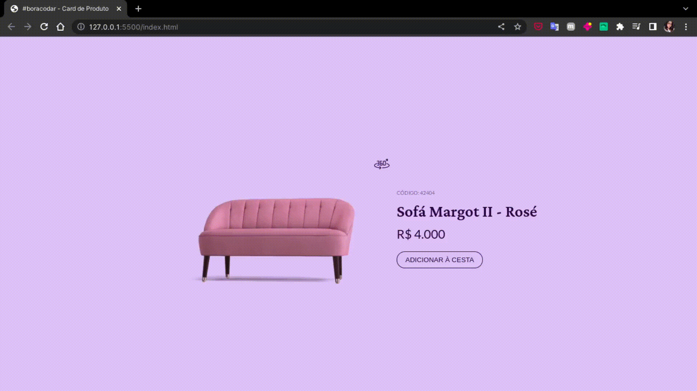

# #boracodar desafio 2 - Card de produto

Essa é uma solução para o desafio 2 do [boracodar.dev](https://boracodar.dev/).

## O desafio

Desenvolver um card de produto com um botão que ao clicar altera a imagem do produto para um link mostrando seus detalhes.

## Tecnologias utilizadas

- HTML5
  - Estou tentando utilizar conceitos de semântica, alterando a utilização de divs para tags com mais significado.
- CSS3
  - Dentre conceitos básicos de CSS, utilizo flexbox para auxílio da disposição dos itens na tela.
- Javascript
  - Para a realização do desafio utilizei manipulação da DOM com javascript ao selecionar os componentes que teriam alteração em sua composição, como o botão em que foi alterado o background e a mudança de imagem para gif do produto.

## Autor

- Meu perfil na Rocketseat - [Yasmin Braga](https://app.rocketseat.com.br/me/yasmin-braga-1568974763)
- FrontendMentor - [@yasminbraga](https://www.frontendmentor.io/profile/yasminbraga)
- Instagram - [@yasminbragat](https://www.twitter.com/yasminbragat)
- Twitter - [@minbragat](https://www.twitter.com/minbragat)

Made with :heart: by [Yasmin Braga](https://github.com/yasminbraga)
